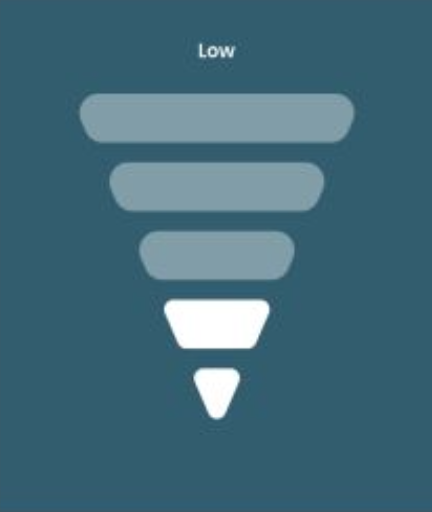

# Intellect Case Study

This project is created using Vite.

## Tools and Libraries Used

- pnpm
- Vite
- React
- [Emotion](https://emotion.sh/docs/introduction) for Styles
- [Vitest](https://vitest.dev/) for Unit tests
  - Happy DOM
  - V8 for coverage
  - Vitest UI
- [Tanstack Router](https://tanstack.com/router/latest)
  - Tanstack Router [Vite Plugin](https://tanstack.com/router/latest)

## Setup and Instructions

```sh
pnpm install
```

Run Dev Server using

```sh
pnpm run dev
```

Run tests Using

```sh
pnpm test
```

Since we are using Vitest UI it will automatically open a localhost webpage with an interface for accessing all the tests and coverage reports.

## Structure

Like every app, starts with `main.ts`. `App.tsx` does nothing but exporting a Router.

**We are using a file based routing and `routeTree.gen.ts` is generated automatically.**

This is possible thanks to the Vite Plugin mentioned above. Look at `vite.config.ts` for more details.

### How do I navigate?

Most of the source code is in the widgets folder. A folder for each widget requested.

A route is created for each widget requested in the case study. The introduction of a router is just for the ease of trying out the widgets without modifying the source code.

## Signal Level Widget



This Widget has two variants.

**`SignalLevel.tsx`** This is built using SVGs files in trying to stay as close as possible to design.

- This Widget uses 5 different SVG files specified as an object in the `src/assets/signalLevelSVGs.ts`. Representing each level's unique look. These SVGs are used to scale the Widget to not just the 5 levels, but virtually any number of levels. It can be provided as a prop to the Widget.

**`SignalLevelLite.tsx`** This is built using purely html and css styles. This too scales to any number of levels just like the SVG based solution. This just doesn't look like the Design. But does the job.

## Process Indicator Widget


This Widget has it's own readme at `src/widgets/progress-indicator/README.md`. Please read there.

## Gotchas

- Every Widget is customizable to an extent via props. Please specify the custom props in the route definitions in `src/routes` based respective widget's prop types in the widget definitions.

- Routes doesn't have test cases yet. Tanstack router is still at an early stage and doesn't provide an easy way to test these. Technically we can do this with some effort but for our usecase the routes doesn't have any business logic in them so i skipped these.

- Weirdly the styled components are showing up as uncovered branches in the Coverage report briging down the metrics. This needs to be investigated.
