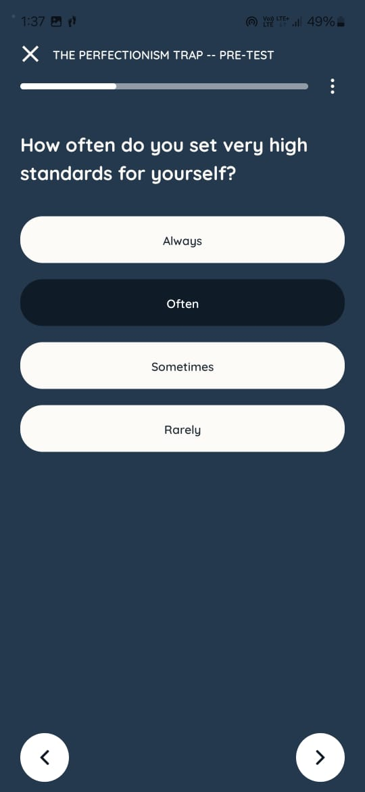

### Positives

- The onboarding flow is excellent.
- The color schemes, sprites, and illustrations are very well done.
- The uniform nature of card-based workflows is very appealing.
- The insights feature that captures daily emotions is a nice addition.

### Improvements

It would be nice to navigate to the next field using the keyboard.
&nbsp;

&nbsp;

It would be helpful to have the option to cancel the popup and highlight current selected value.
&nbsp;

&nbsp;

This popup was introduced abruptly and are too technical. Affirmation that i can revisit this is missing.
&nbsp;

&nbsp;

The progress bar is inconsistent everywhere.
&nbsp;

&nbsp;

Search results are often irrelevant.
&nbsp;

&nbsp;

It's difficult to distinguish between radio buttons and checkboxes without understanding them through context.
&nbsp;

&nbsp;

The "Your Goals" section suddenly uses a different style.

what does "completing a goal" mean? How do I decide that?
&nbsp;

&nbsp;

It took me very long to understand that the "mood tracking" feature is called Insights. If Insights CTA's illustration show the easily recognizable mood illustrations it would've been easy to find.
&nbsp;

&nbsp;

I cannot click on the mood button of the day in the above screen to open the Check-in Details. Had to figure out by brute force to get to this screen.
&nbsp;

&nbsp;

The "Connect to SOS Support" feature can be improved as it seems to be using a WebView and that fact is evident.
&nbsp;

&nbsp;

The home page is cluttered with too many CTAs as a new user i was confused as to which feature to use first. May be a better "division of concerns" approach need to be applied for the homepage layout.
